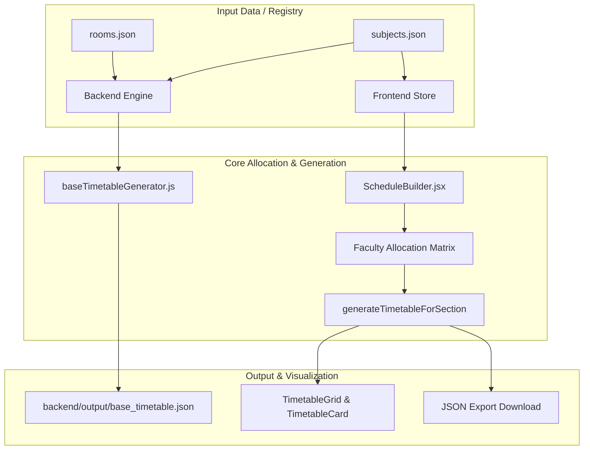

# FATGS — Faculty Allocation & Timetable Generation System

FATGS is an automated academic scheduling and faculty allocation system designed for the **Department of Computer Science & Engineering, National Institute of Technology Hamirpur**. It provides constraint-based weekly timetable generation, interactive faculty assignment, and real-time conflict detection for B.Tech and M.Tech sections.

---

## Overview

Academic timetable scheduling in higher education involves managing complex constraints across courses, faculty rosters, and physical room capacity. FATGS addresses this challenge by providing:

- A **Node.js timetable generation engine** that enforces institutional scheduling rules (contiguous lab periods, balanced theory distribution, room assignment, and collision avoidance).
- A **React + Vite interactive studio** that allows academic coordinators to inspect curriculum requirements, assign faculty members dynamically with instant validation, generate section timetables, and export conflict-free schedules as JSON.

FATGS is targeted at academic coordinators, department timetable committees, and faculty in charge of scheduling at NIT Hamirpur.

---

## Key Features

- **Interactive Timetable Studio**: Academic year, semester, and section selector with dynamic course and laboratory breakdown.
- **Dynamic Faculty Allocation Matrix**: GUI-driven faculty assignment per course with constraint filtering (prevents a faculty member from being assigned multiple theory courses or labs within the same section).
- **Constraint-Based Scheduling Engine**:
  - Laboratory practicals scheduled as contiguous 2-hour blocks with dedicated lab room allocation.
  - Theory lectures load-balanced across Monday–Friday weekdays.
  - Institutional 13:00–14:00 lunch break strictly preserved.
  - Conflict prevention for room bookings and faculty commitments across sections.
- **Section Support**: Preconfigured curriculum for B.Tech CSE sections including 2nd Year (CS2, CD2) and 3rd Year (CS3, CD3) across semesters.
- **JSON Export**: One-click download of generated schedules into standardized JSON format (`base_timetable.json`) for departmental record-keeping and downstream integrations.
- **Institutional Design System**: Clean, accessible academic UI matching NIT Hamirpur identity with responsive layout.

---

## Architecture

FATGS separates scheduling business logic into two operational environments:

1. **Client-Side Studio (Frontend)**: Runs locally in the browser to deliver a responsive, live generation workflow without requiring external database connections.
2. **Batch Generation Engine (Backend)**: Standalone Node.js scripts capable of batch-generating conflict-free schedules across all sections simultaneously from static curriculum and room datasets.



---

## Tech Stack

### Frontend
- **Framework**: React 18 (`react`, `react-dom`)
- **Build Tool**: Vite 6 (`@vitejs/plugin-react`)
- **Styling**: Vanilla CSS (Custom institutional design tokens, typography, and responsive grid)
- **Icons**: Inline scalable SVGs (zero external icon library overhead)

### Backend & Generation Engine
- **Runtime**: Node.js (v18+ recommended)
- **Modules**: Native CommonJS (`fs`, `path`) with zero production runtime dependencies
- **Dev Tooling**: Nodemon for file-watching during backend development

### Data Storage
- **Format**: Structured JSON configuration files (`backend/data/subjects.json`, `backend/data/rooms.json`)

---

## Project Structure

```text
FATGS/
├── backend/
│   ├── data/
│   │   ├── rooms.json                  # Classroom & lab registry with capacities
│   │   └── subjects.json               # Departmental curriculum by year, sem & section
│   ├── entities/
│   │   ├── assignPlaceholderFaculty.js # Demo/testing faculty assignment helper
│   │   ├── baseTimetableGenerator.js   # Batch timetable generator script
│   │   ├── facultyAllocation.js        # Faculty assignment validation logic
│   │   ├── functions.js                # JSON curriculum parser utilities
│   │   ├── Room.js                     # Room entity class
│   │   ├── Section.js                  # Section & schedule grid model
│   │   └── Subject.js                  # Subject, Lab & Elective models
│   ├── output/
│   │   └── base_timetable.json         # Generated batch timetable output (gitignored)
│   └── index.js                        # CLI entry point for testing subject data
├── frontend/
│   ├── public/
│   │   └── nith-logo.png               # Official NIT Hamirpur logo
│   ├── src/
│   │   ├── components/
│   │   │   ├── Footer.jsx              # Institutional footer
│   │   │   ├── Header.jsx              # Institutional identity & status header
│   │   │   ├── TimetableCard.jsx       # Schedule card component
│   │   │   ├── TimetableGrid.jsx       # Weekly timetable grid (Monday–Friday)
│   │   │   └── Toast.jsx               # Feedback notifications
│   │   ├── data/
│   │   │   └── timetableData.js        # Section configs, roster & generator engine
│   │   ├── styles/
│   │   │   ├── index.css               # Design system tokens & layout
│   │   │   └── timetable.css           # Timetable grid & card styles
│   │   ├── views/
│   │   │   └── ScheduleBuilder.jsx     # Main Timetable Studio view
│   │   ├── App.jsx                     # Root application component
│   │   └── main.jsx                    # Vite React entry point
│   ├── index.html                      # Single page application HTML shell
│   ├── package.json                    # Frontend dependencies & scripts
│   └── vite.config.js                  # Vite configuration
├── .gitignore
├── package.json                        # Root orchestration scripts
└── README.md
```

---

## Installation

### Prerequisites
- [Node.js](https://nodejs.org/) (version 18.0.0 or higher)
- `npm` (bundled with Node.js)

### Setup Steps

1. **Clone the repository:**
   ```bash
   git clone https://github.com/Ankur17nith/FATGS.git
   cd FATGS
   ```

2. **Install root dependencies:**
   ```bash
   npm install
   ```

3. **Install frontend dependencies:**
   ```bash
   cd frontend
   npm install
   cd ..
   ```

---

## Environment Variables

FATGS is designed to run self-contained without external database credentials or third-party API keys.

Optional port configuration:
- `PORT`: Overrides the default port for local development servers if needed. Default frontend development server port is `5173`.

---

## Running Locally

All primary actions can be run directly from the project root:

| Command | Description |
|---|---|
| `npm run dev` | Starts the interactive Timetable Studio in development mode with hot reload at `http://localhost:5173` |
| `npm run build` | Compiles the production bundle in `frontend/dist` |
| `npm run preview` | Previews the production build locally |
| `npm run generate` | Runs the backend timetable generator and outputs `backend/output/base_timetable.json` |
| `npm run backend` | Parses curriculum data and prints section object graphs to console |
| `npm run backend:dev` | Runs backend entry point with nodemon file watching |

---

## Core Workflow

```text
Select Academic Year -> Select Semester -> Select Section
                       │
                       ▼
Inspect Course & Laboratory Requirements
                       │
                       ▼
Assign Faculty (or leave for Auto-Allocation)
                       │
                       ▼
Click "Generate Base Timetable"
                       │
                       ▼
Constraint Engine Validates & Places Slots:
  - Contiguous 2-hour laboratory sessions
  - Single-hour theory lectures across weekdays
  - Lunch break protection (13:00 - 14:00)
  - Collision-free room and faculty scheduling
                       │
                       ▼
Inspect Visual Schedule Grid & Export JSON
```

---

## Backend Engine Usage

You can run the timetable generation engine directly from the command line:

```bash
node backend/entities/baseTimetableGenerator.js [subjectsJsonPath] [roomsJsonPath] [outDir]
```

### Arguments (Optional)
- `subjectsJsonPath`: Path to custom subjects JSON (default: `backend/data/subjects.json`).
- `roomsJsonPath`: Path to custom rooms JSON (default: `backend/data/rooms.json`).
- `outDir`: Directory where generated timetable JSON is written (default: `backend/output`).

### Flags
- `--no-placeholder-faculty`: Disables placeholder faculty assignment, leaving unallocated faculty slots unassigned.

---

## Development Guidelines

- **Clean Imports**: Keep frontend component dependencies localized within `frontend/src`.
- **Zero Heavy Dependencies**: Avoid adding external CSS frameworks or icon libraries; utilize the established design tokens in `index.css` and inline SVGs.
- **Constraint Verification**: When modifying allocation or generation algorithms in `backend/entities/` or `frontend/src/data/timetableData.js`, test with both 2nd-year and 3rd-year sections to guarantee collision-free output.
- **Build Validation**: Always verify the production build before committing changes:
  ```bash
  npm run build
  ```

---

## Troubleshooting

### Port Conflicts
If port `5173` is occupied:
```bash
# In frontend/vite.config.js, change the port number:
server: {
  port: 5174,
  open: false
}
```

### Out-of-sync Dependencies
If packages fail to resolve:
```bash
# Clean install in frontend
cd frontend
npm ci
cd ..
```

---

## Contributing

1. Create a descriptive feature branch:
   ```bash
   git checkout -b feature/improved-room-allocation
   ```
2. Implement your changes adhering to existing code conventions.
3. Test local builds (`npm run build` and `npm run generate`).
4. Commit your changes with clear messages:
   ```bash
   git commit -m "Optimize room allocation constraint checking"
   ```
5. Push to the branch and submit a Pull Request.

---

## License & Attribution

Internal Academic Project — **Department of Computer Science & Engineering, National Institute of Technology Hamirpur**, Himachal Pradesh, India.
